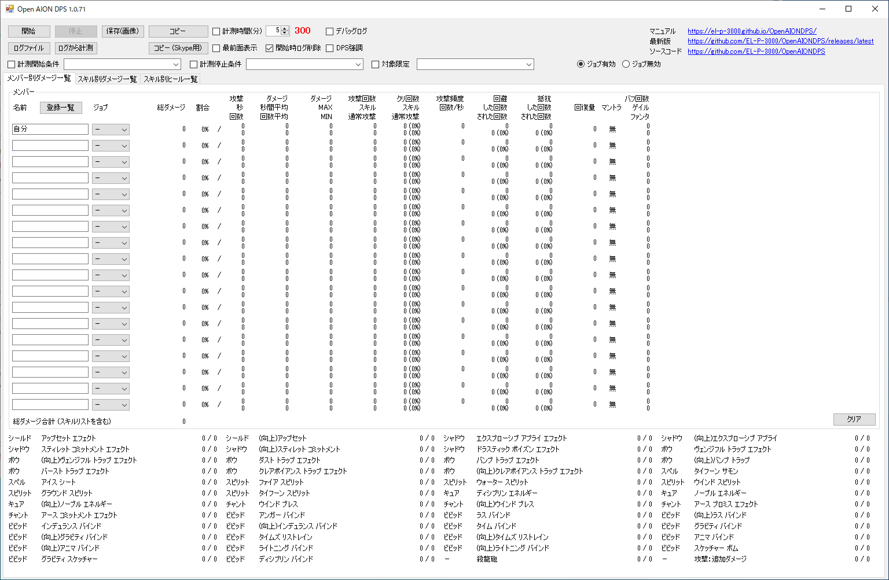

# Open AION DPS
このツールは、日本語版 The Tower of AION のDPSを計測するツールです。  
このツールを利用するには、日本語版 The Tower of AION の設定を変更して、Chat.logにログを出力する必要があります。
Chat.logの出力については別のホームページで探して設定してください。  
  
最新版のツールは次の場所から「OpenAIONDPS.exe」をダウンロードしてください。  
[最新版へのリンク](https://github.com/EL-P-3000/OpenAIONDPS/releases/latest)  
  
* 動作確認  
CPU: Intel Core i9-9900K  
RAM: 64GB  
GPU: NVIDIA GeForce GTX 2080 TI  
OS: Microsoft Windows 10 Pro 64bit  

* 開発  
ソフト: Microsoft Visual Studio Enterprise 2019  
言語: C#  

ツールのメイン画面 (Version 1.0.67)  

登録一覧画面  

## 開始
計測を開始します。  
開始後はメンバー名やジョブ、計測開始/終了条件等の設定の変更ができませんので、全ての設定を終えた後に開始を押してください。  
AIONがデフォルトのフォルダにインストールされていない場合はログファイルが選択されていないエラーがでますので、「ログファイル」ボタンからAIONがインストールされているフォルダにある「Chat.log」を選択してください。

## 停止
計測を停止します。

## ログファイル
AIONがデフォルトのディレクトリにインストールされていない場合にこのボタンからログファイルを選択します。

## ログから計測
リアルタイムの計測ではなく、過去のログファイルから計測します。

## 保存(画像)
画面をPNGファイルとして保存します。

## コピー
計測結果をクリップボードにテキストでコピーします。  
メモ帳に貼り付けた場合に、きれいに整形されて見ることができます。

## コピー (Skype用)
計測結果をクリップボードにテキストでコピーします。  
スカイプに貼り付けた場合に、きれいに整形されて見ることができます。  
スカイプのバージョンや環境によっては整形されず、ずれて表示される場合があるかもしれません。  

## 計測時間(分)
チェックを入れると計測時間を分単位で設定します。  
ダメージが更新された時が計測開始となります。  
HP回復スキルを使用した場合、メンバーリストの方は計測が開始されて攻撃の秒が増加しますが、計測時間には影響せず、計測開始にはなりません。  

## 最前面表示
チェックを入れるとツールを最前面に固定します。  

## デバッグログ
開発者用の機能で、ツール開発のデバッグに利用します。  
ツールと同じフォルダにファイル名「Debug.log」が作成され、計測に利用したログと例外が保存されます。  
「Chat.log」と「Debug.log」の差分をとることで、計測に利用していないログ(回復ログなど)となり、計測していないログに本来計測されなければいけないログがないかの確認が可能です。  

## 開始時ログ削除
開始ボタンを押下した際に「Chat.log」の内容を消去します。  
内容を削除することで処理の軽減や計測後にログファイルを再読み込みする際に役立ちます。  
以前の内容を消去したくない場合はチェックをはずしてください。  

## DPS強調
各メンバーのDPSの項目のフォントサイズを大きくし、赤字の太字に変更します。  

## ジョブ有効／ジョブ無効  
有効にした場合でメンバーに同一のジョブが2人以上いない場合は、下段のスキルリストのジョブに対するスキルのダメージがメンバーの総ダメージに加算され、スキルリストのダメージは0となります。  メンバーに同一のジョブが2人以上いる場合は、下段のスキルリストのスキルによるダメージはメンバーに加算されず、スキルに加算されます。    
無効にした場合は、下段のスキルリストの各スキルのダメージはジョブでメンバーを特定せずに全てスキルに加算されます。  

## 対象限定  
計測する際の攻撃対象を限定します。  
攻撃対象のフルネームを入力またはリストから選択します。  

## 計測開始条件  
指定した文字列にログがマッチした場合に計測を開始します。  
先頭の「^」と末尾の「$」を削除した正規表現で完全一致の文字列を入力します。  

## 計測停止条件  
指定した対象から経験値を取得した場合に計測を停止します。  
計測開始条件とは異なり、条件は経験値取得のみとなり、正規表現ではなく対象名を入力します。  

## ホットキー
CTRL＋F1で計測開始／計測停止
  
***
  
# メンバー別ダメージ一覧
* メンバー (名前／ジョブ)  
計測したいキャラの名前をフルネームで入力し、キャラのジョブを選択します。  
計測者のデフォルト名は「自分」となりますが、キャラクター名を設定したい場合は「登録一覧」で「自分のキャラクター名一覧」にキャラクター名を入力し、保存します。  
* 総ダメージ
* 割合  
総ダメージ×100／総ダメージの合計
* 攻撃秒  
最初の攻撃から最後の攻撃までの時間
* 攻撃回数
* ダメージ秒間平均  
総ダメージ×100／攻撃秒
* ダメージ回数平均  
総ダメージ×100／攻撃回数
* ダメージMAX
* ダメージMIN
* 攻撃回数 スキル  
回避されたスキル攻撃を含む
* 攻撃回数 通常攻撃  
回避された通常攻撃を含む
* クリティカル スキル  
スキルクリティカル回数×100／スキル攻撃回数
* クリティカル 通常攻撃  
通常攻撃クリティカル回数×100／通常攻撃回数  
ログには他人の通常攻撃のクリティカルはクリティカルと表示されないため自分のみの計測となります。  
* 回数／秒  
攻撃回数／攻撃秒
* 回避した回数
* 回避された回数／率  
率＝回避された回数×100／攻撃回数
* 抵抗した回数
* 抵抗された回数／率  
率＝抵抗された回数×100／攻撃回数
* 回復量
自分が自分または他人をヒールした際の回復量の合計
* マントラ
チャントの各種マントラのバフの有無
* バフ
チャントのゲイル スペルの回数メロディのディストラクション ファンタジアの回数
* 総ダメージ合計（スキルリスト含む）  
全員の総ダメージの合計と、下段のスキルリストの各ダメージの合計です。  
* スキルダメージリスト  
ログからメンバーの特定が困難／不可能なスキルのリストです。  
これらのスキルは基本的にメンバーに加算されずにスキル別にダメージが加算されますが、「ジョブ有効」にしていた場合はジョブ判定が行われます。
* 登録一覧  
キャラの名前とジョブを登録するウインドウが表示され、次回以降は一覧から追加できます。  
* クリア  
データを削除し、起動時の状態に戻します。
  
***
  
# スキル別ダメージ一覧
* メンバー名
* スキル名
* 総ダメージ
* 回数
* MAXダメ(クリ無)
* MINダメ(クリ無)
* MAXダメ(クリ有)
* MINダメ(クリ有)
* 平均ダメージ  
総ダメージ／回数
* 保存(画像)  
画面をPNGファイルとして保存します。

# スキル別ヒール一覧
* メンバー名
* スキル名
* 総回復量
* 保存(画像)  
画面をPNGファイルとして保存します。
